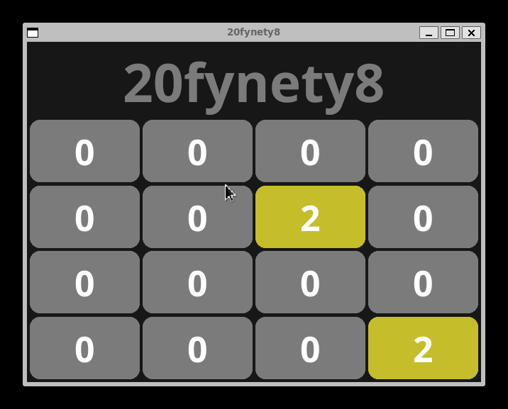

# 20fynety8 - A fyne 2048  
  

**20fynety8 - A fyne 2048**  
I made this 2048 clone in go to exercise basic matrix operations.  
Fyne is a GUI framework for go.  
20fynety8 is the result.  

### Install:  
1- install go  
[https://go.dev/doc/install](https://go.dev/doc/install)  
2- install fyne  
[https://docs.fyne.io/started/](https://docs.fyne.io/started/)  
3- clone the repo  
4- `go run main.go`  

### Usage:  
- control with arrow keys

### Disclaimer:  
There's a bug where if the player takes an action that results in not spawning a new number (ex: moving up resulting in no tile relocation) after the window is closed an error log is displayed, i assume it's something with fyne.  

Since this happens after the window is closed and doesn't affect UX (ie playing the game) i'm not too concerned about it, but if your OCD is bothering you... I mean, the code is right there.
